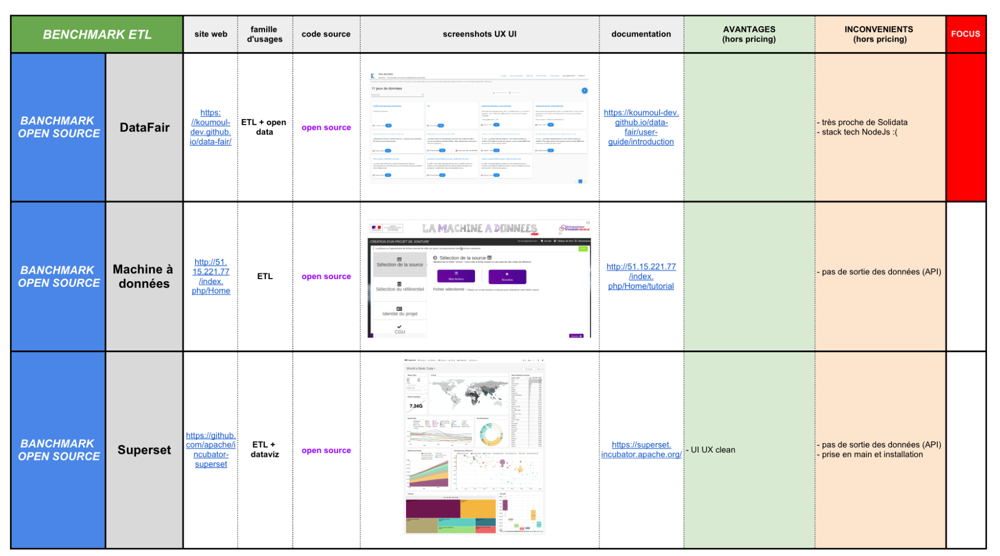
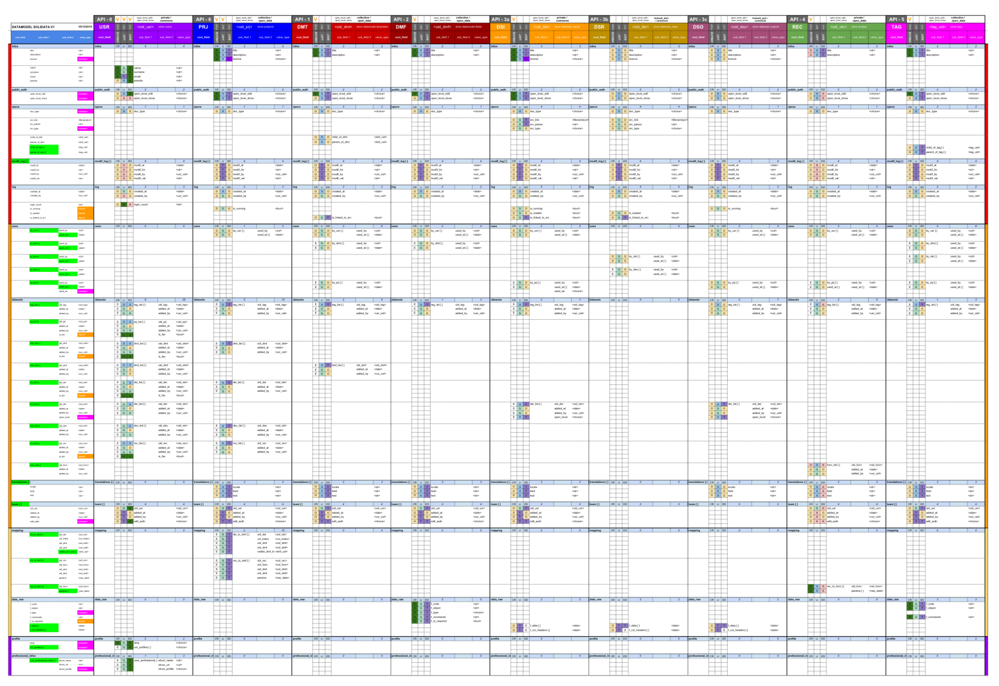

<h1 align=center>  SOLIDATA <br> frontend</h1>

-------

<h2 align=center>
	
</h2>

-------

")

-------
## PRESENTATION

part 2b/3 of the TADATA! sofware suite ([ApiViz](https://github.com/entrepreneur-interet-general/CIS-front) / [Solidata_backend](https://github.com/entrepreneur-interet-general/solidata_backend) / [OpenScraper](https://github.com/entrepreneur-interet-general/OpenScraper) )

#### Building a public service for managing, consolidating, and sharing data 


-------

## GOALS

- an intuitive UX to manage open data projects ;
- support for multilingual (english, french, spanish to begin with) ;
- allow you to consume data from your own csv/xls files or external APIs ;
- consolidate your data : apply your own datamodel, simplify columns, apply metadatas, ... ; 
- share the consolidated datas on API endpoints with the level of openness you decide (opendata, commons, collective, private) ;
- manage all your data and your recipes by projects ;
- be able to manage projects by teams and share data/recipes/datamodels...

------

## DEVELOPPERS

Nice to see you around ! For a more complete tour check out : 
- our *[guidelines](./GUIDELINES_DEV.md)*
- our *[changelog](./CHANGELOG.md)*
- our *[contribution guide](./CONTRIBUTING.md)*

--------

## TECHNICAL POINTS

#### Tech stack
- _Language_  : **[Javascript](https://www.python.org/)**... not my cup of tea but still...
- _Framework (js)_ : **[Vue.js](https://vuejs.org/)** and **[Nuxt.js](https://nuxtjs.org/)**... Universal Vue.js Applications
- _Framework (styles)_ : **[vuetify](https://vuetifyjs.com/)**... Material Design Component Framework
- _Requests_ : **[Axios module for nuxt](https://axios.nuxtjs.org/)**... Secure and Easy Axios integration with Nuxt.js.
- _Internationalization_ : **[i18n module for nuxt](https://nuxtjs.org/examples/i18n)**... do you speak french, english, spanish, turkish ? 
- _Encryption_ : **[js-encrypt](http://travistidwell.com/jsencrypt/)**... RSA encryption when critical data is exchanged between back and front

#### Features :

- intuitive UX 
- **multilingual** : FR, EN, ESP
- login / register
- import a **dataset** (dataset input) : from a file (csv, , xlsx) or from an external API
- manage / create **datamodel templates** (schemas) from datamodel fields
- manage / create **datamodel fields** 
- manage / create **open data projects** : choose a datamodel, add several datasets and associate each with a datamodel, choose the level of open data for each datamodel field,solidify the compiled data with external API, export the compiled data (csv, or API endopoints)
- asymetrical **encryption** by RSA (password, email, ...) and JWT authentification (access and refresh tokens)

#### Features TO DO  :
- tutorials (videos)
- RGPD compliance
- dataviz of a project (PRJ) - with Chart.js or D3.js
- map of a geolocalized project - with Leaflet

-------


## BUILD SETUP

``` bash
# install dependencies
$ npm install # Or yarn install

# serve with hot reload at localhost:3000
$ npm run dev

# build for dev and launch server
$ npm run build_dev
$ npm start_dev

# build for production and launch server
$ npm run build
$ npm start

# build for preprod and launch server
$ npm run build_preprod
$ npm start_preprod

# generate static project
$ npm run generate
# or
$ npm run generate_preprod
# or
$ npm run generate_dev
```

For detailed explanation on how things work, check out the [Nuxt.js](https://github.com/nuxt/nuxt.js) and [Vuetify.js](https://vuetifyjs.com/) documentation.


--------

## BENCHMARK ETL (open source or proprietary)

<a href="./screenshots/documentation/Tadata_uses_features_BENCHMARK_ETL.pdf" download>Download the benchmark as a PDF file</a>




--------

## DATA MODEL BACKEND

<a href="./screenshots/documentation/Solidata_models_datamodels_map.pdf" download>Download the datamodel as a PDF file</a>





--------

## GLOBAL ARCHITECTURE & COMPONENTS

<a href="./screenshots/documentation/Solidata-Models-collections.pdf" download>Download the global architecture schema as a PDF file</a>


-------

## AUTHORIZATION PROCESS (access & refresh tokens)

<a href="./screenshots/documentation/AUTH_PROCESS_fixed.pdf" download>Download the schema as a PDF file</a>


-------

## CREDITS 

#### Solidata's frontend team thanks :

- the [SocialConnect](https://entrepreneur-interet-general.etalab.gouv.fr/defi/2017/09/26/socialconnect/) project, aka "Carrefour des Innovations Sociales"
- the [EIG](https://entrepreneur-interet-general.etalab.gouv.fr/) program by [Etalab](https://www.etalab.gouv.fr/)
- the [CGET](http://www.cget.gouv.fr/)
- [Christophe Ninucci](https://github.com/chrnin) for his help, advices and taste for memes
- the [creator](https://github.com/noirbizarre) and community of [Flask RestPlus](https://github.com/noirbizarre/flask-restplus)

#### Contacts - maintainance :

- [Julien Paris](<mailto:julien.paris@cget.gouv.fr>), developer (aka [JPy](https://twitter.com/jparis_py) on Twitter, or [Jpy](https://github.com/JulienParis) on Github)


-------

## SCREENSHOTS (UI/UX)


-------
Home page with the side menu

")

-------
Login page

")

-------
Main dashboard 

")

-------
Create a new project

")

-------
Edit a project : add datasets, choose a datamodel, choose the visibiilty of each datamodel field for your project...

")

-------
Map each of your project's datasets to your datamodel

")

-------
Overview of all the datamodels shared and created by the community

")

-------
Overview of all the datamodel fields created and shared by the community

")

-------
Preview of a datasets uploaded by an user

")

-------
Edit a datamodel 

")

-------
View of all the settings of a datamodel

")

-------
Edit a datamodel field

")

-------
View of all the settings of a datamodel field

")