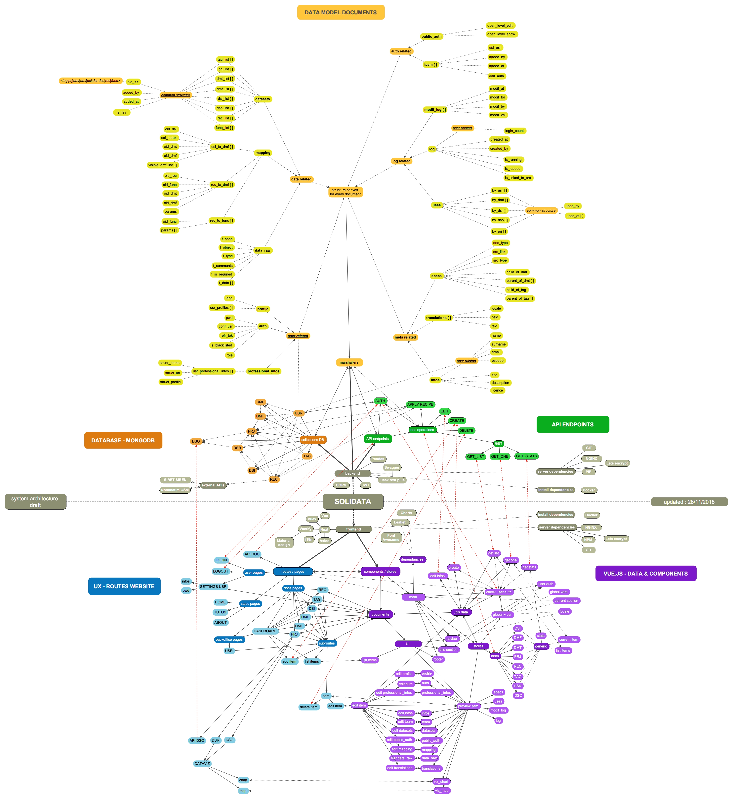
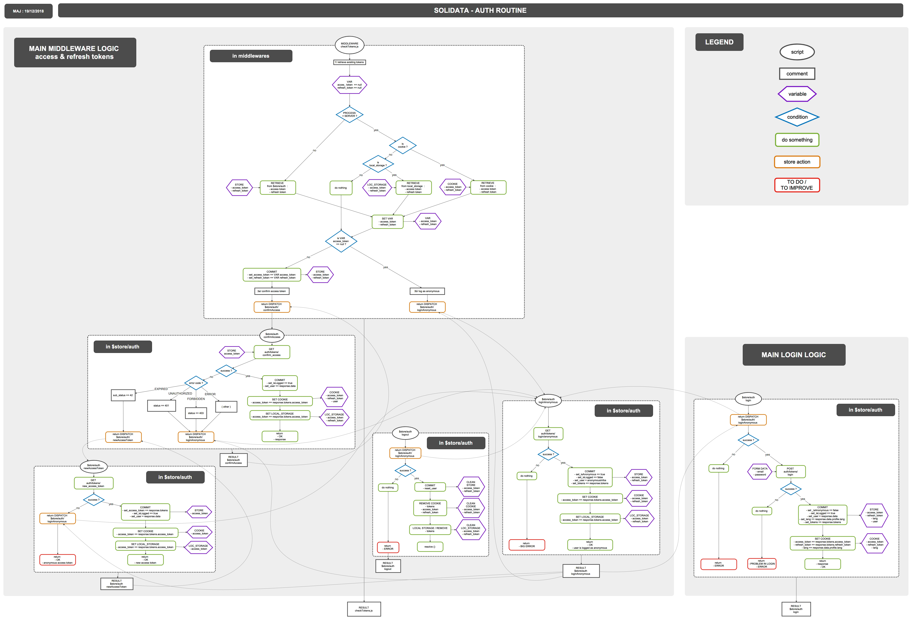

<h1 align=center>  SOLIDATA <br> frontend</h1>

-------

<h2 align=center>
	
</h2>

-------

")

-------
## PRESENTATION

part 2b/3 of the TADATA! sofware suite ([ApiViz](https://github.com/entrepreneur-interet-general/CIS-front) / [Solidata_backend](https://github.com/entrepreneur-interet-general/solidata_backend) / [OpenScraper](https://github.com/entrepreneur-interet-general/OpenScraper) )

#### Building a public service for managing, consolidating, and sharing data 


-------

## GOALS

- an intuitive UX to manage open data projects ;
- support for multilingual (english, french, spanish to begin with) ;
- allow you to consume data from your own csv/xls files or external APIs ;
- consolidate your data : apply your own datamodel, simplify columns, apply metadatas, ... ; 
- share the consolidated datas on API endpoints with the level of openness you decide (opendata, commons, collective, private) ;
- manage all your data and your recipes by projects ;
- be able to manage projects by teams and share data/recipes/datamodels...

--------

## TECHNICAL POINTS

#### Tech stack
- _Language_  : **[Javascript](https://www.python.org/)**... not my cup of tea but still...
- _Framework (js)_ : **[Vue.js](https://vuejs.org/)** and **[Nuxt.js](https://nuxtjs.org/)**... Universal Vue.js Applications
- _Framework (styles)_ : **[vuetify](https://vuetifyjs.com/)**... Material Design Component Framework
- _Requests_ : **[Axios module for nuxt](https://axios.nuxtjs.org/)**... Secure and Easy Axios integration with Nuxt.js.
- _Internationalization_ : **[i18n module for nuxt](https://nuxtjs.org/examples/i18n)**... do you speak french, english, spanish, turkish ? 

#### Features :

- intuitive UX 
- locales : FR, EN, ESP
- login / register
- import a dataset
- manage / create datamodel templates (schemas) from datamodel fields
- manage / create datamodel fields 
- manage / create dataset inputs 

##### Features TO DO  :
- tutorials (videos)
- RGPD compliance
- 

-------


## BUILD SETUP

``` bash
# install dependencies
$ npm install # Or yarn install

# serve with hot reload at localhost:3000
$ npm run dev

# build for production and launch server
$ npm run build
$ npm start

# generate static project
$ npm run generate
```

For detailed explanation on how things work, check out the [Nuxt.js](https://github.com/nuxt/nuxt.js) and [Vuetify.js](https://vuetifyjs.com/) documentation.


--------

## BENCHMARK ETL (open source or proprietary)

<a href="./screenshots/documentation/Tadata! uses & features - BENCHMARK_ETL.pdf" download>Download the benchmark as a PDF file</a>

--------

## DATA MODEL & COMPONENTS

<a href="./screenshots/documentation/Solidata_models - v.0.1 - datamodels_map.pdf" download>Download the datamodel as a PDF file</a>





-------

## AUTHORIZATION PROCESS (access & refresh tokens)

<a href="./screenshots/documentation/AUTH_PROCESS_fixed.pdf" download>Download the schema as a PDF file</a>




-------

## SCREENSHOTS (UI/UX)


-------
")

-------
")

-------
")

-------
")

-------
")

-------
")

-------
")

-------
")

-------
")

-------
")